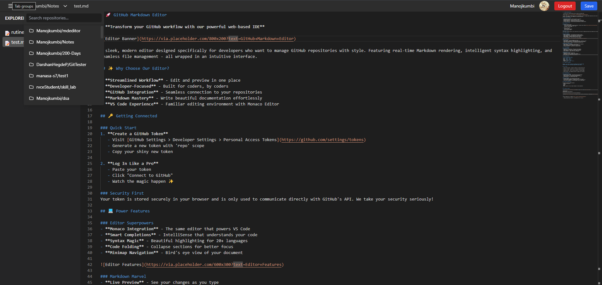
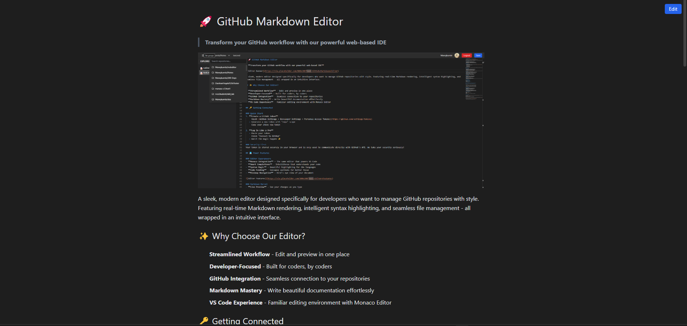

# 🚀 GitHub Markdown Editor

> **Transform your GitHub workflow with our powerful web-based IDE**

A sleek, modern editor designed specifically for developers who want to manage GitHub repositories with style. Featuring real-time Markdown rendering, intelligent syntax highlighting, and seamless file management - all wrapped in an intuitive interface.

## Why Choose Our Editor?

- **Streamlined Workflow** - Edit and preview in one place
- **Developer-Focused** - Built for coders, by coders
- **GitHub Integration** - Seamless connection to your repositories
- **Markdown Mastery** - Write beautiful documentation effortlessly
- **VS Code Experience** - Familiar editing environment with Monaco Editor

## Getting Connected

### Quick Start
1. **Create a GitHub Token**
   - Visit [GitHub Settings > Developer Settings > Personal Access Tokens](https://github.com/settings/tokens)
   - Generate a new token with 'repo' scope
   - Copy your shiny new token

2. **Log In Like a Pro**
   - Paste your token
   - Click "Connect to GitHub"
   - Watch the magic happen 

### Security First
Your token is stored securely in your browser and is only used to communicate directly with GitHub's API. We take your security seriously!

## 💻 Power Features

### Editor Superpowers
- **Monaco Integration** - The same editor that powers VS Code
- **Smart Completions** - IntelliSense that understands your code
- **Syntax Magic** - Beautiful highlighting for 20+ languages
- **Code Folding** - Collapse sections for better focus
- **Minimap Navigation** - Bird's eye view of your document

### Markdown Marvel
- **Live Preview** - See your changes as you type
- **GFM Support** - GitHub Flavored Markdown with tables, checklists & more
- **Code Block Highlighting** - Syntax highlighting within your markdown
- **Smart Formatting** - Beautiful formatting with minimal effort

### Repository Command Center
- **Quick Repository Switching** - Jump between projects instantly
- **Smart Search** - Find repositories in a flash
- **File Tree Navigation** - Explore your code with ease
- **Change Indicators** - Visual cues for modified files

## File Management

### Creating Content
- **Right-Click → "New File"** - Add files to your project
- **Right-Click → "New Folder"** - Organize your repository
- **Easy Renaming** - Quick renames with right-click menu
- **Safe Deletion** - Remove files with confirmation

### Editing Like a Pro
- **Auto-Save** - Never lose your work
- **Keyboard Shortcuts** - Speed up your workflow
- **Undo/Redo** - Mistakes happen, we've got you covered
- **Find & Replace** - Powerful text operations

## ⌨️ Keyboard Ninjas

| Action | Windows/Linux | Mac |
|--------|--------------|-----|
| Save | `Ctrl+S` | `⌘+S` |
| Undo | `Ctrl+Z` | `⌘+Z` |
| Find | `Ctrl+F` | `⌘+F` |
| Replace | `Ctrl+H` | `⌘+H` |
| Toggle Preview | `Ctrl+P` | `⌘+P` |

## 💡 Pro Tips

> **Editor Space Ninja** - Toggle the sidebar for maximum editing area
> 
> **Context is King** - Right-click for contextual options everywhere
> 
> **Modified Files** - Look for the dot indicator for unsaved changes
> 
> **Quick Access** - Use keyboard shortcuts to speed up your workflow

##  Troubleshooting

### Common Rescue Missions
- **Authentication Issues** - Check token scope and expiration
- **Save Failures** - Verify connection and permissions
- **Preview Problems** - Confirm file extensions are correct
- **Performance** - Try clearing browser cache

### Error Translator
- **"Invalid token"** → Your GitHub key needs renewal
- **"Failed to get contents"** → Connection hiccup or access issue
- **"File modified elsewhere"** → Someone beat you to it, reload to sync
- **"Rate limit exceeded"** → Too many requests, take a coffee break

##  Browser Compatibility

We play nice with all modern browsers:
- Chrome (our favorite)
- Firefox
- Safari
- Edge
- Mobile browsers (turn your phone sideways for best experience)

---

## 
**Kumaraswamy**  

Passionate about developer tools and great documentation.

 [@manojkumbi](https://github.com/Manojkumbi)

---

**Project Repository:** [mdeditor](https://github.com/Manojkumbi/mdeditor)

> "_Making documentation beautiful, one Markdown file at a time._"